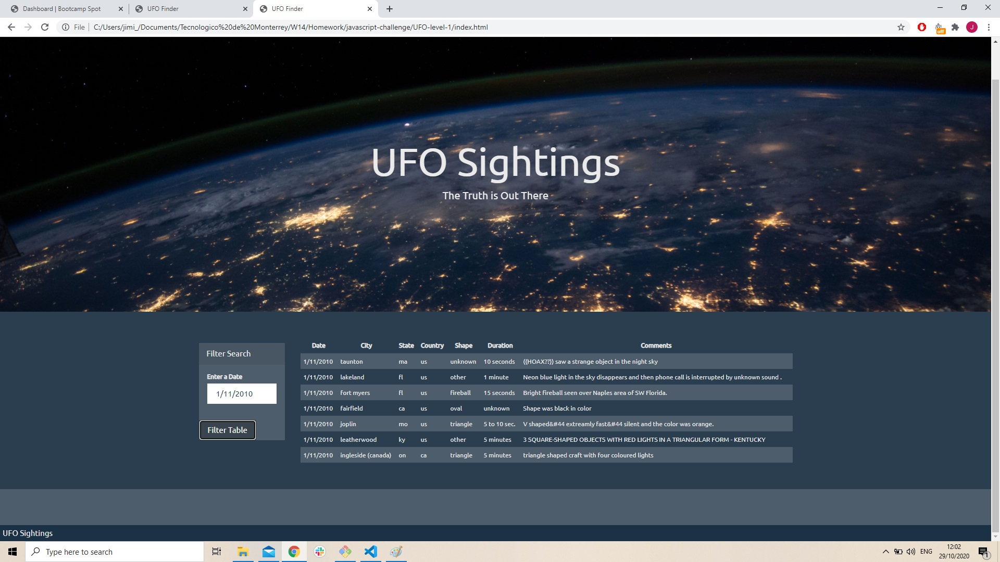
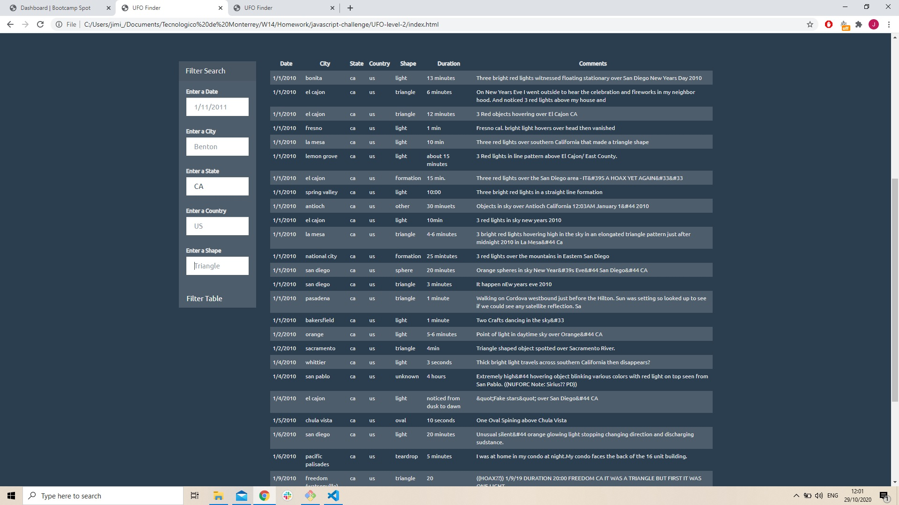

# Javascript-challenge
## Contributor
* Jimi Jenneskens

---
Table of contents 

1. [Starter code](#start)
2. [Level1](#1)
3. [Level2](#2)

---

### Starter code 

#### Common files

* index.html -- provided html page for the assignment.
* static/css/style.css -- style sheet for webpage.
* static/images/nasa.png -- main image for webpage.
* static/js/data.js -- provided UFO dataset for the assignment.
 

### Level1 
#### Automatic Table and Date Search filter
[Go back to the table of contents](#toc)

##### Files

* index.html -- UFO Finder webpage (date search).
* static/js/app.js -- JavaScript for index.html webpage functionality.

### Level 2 
#### Multiple Search Categories filters (optional and complete)
[Go back to the table of contents](#toc)

##### Files

* index.html -- UFO Finder webpage (five filters search).
* static/js/app.js -- JavaScript for index.html webpage functionality.

#### Screenshot level 1

#### Screenshot level 2

